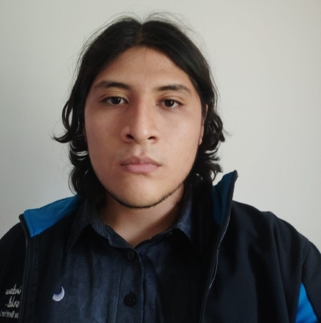
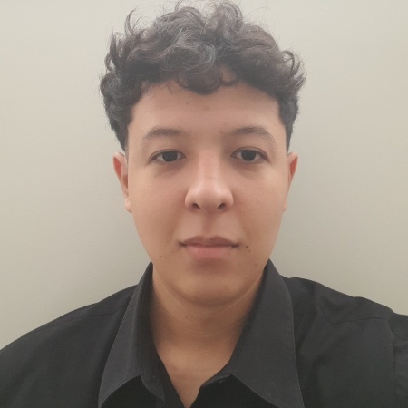
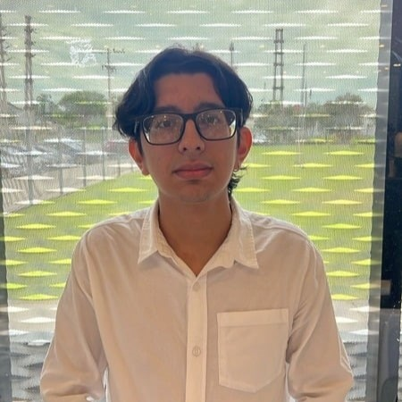
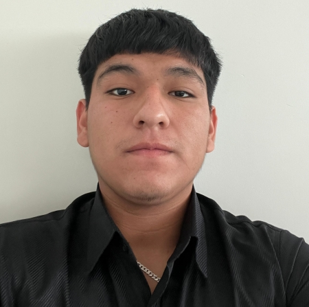

# **Acerca del Equipo**

Nuestro equipo está compuesto por cuatro apasionados desarrolladores que han trabajado arduamente para crear una solución innovadora y funcional. A continuación, te presentamos a los miembros del equipo:

---

## **Mateo Gonzales**

**Rol**: Scrum Master  

**Descripción**: Mateo es experto en la implementación de interfaces de aplicaciones. Con su conocimiento en Flutter y Node.js, asegura que el sistema funcione de manera correcta.

---

## **Renato Escobar**

**Rol**: Desarrollador 

**Descripción**: Renato garantiza que la experiencia del usuario sea siempre excepcional. Su atención al detalle hace que cada elemento del proyecto cobre vida y sea funcional.

---

## **Jose Vargas**

**Rol**: Desarrollador 

**Descripción**: José se asegura de que toda la información esté organizada y protegida ademas de asegurarse de que las interfaces tengan un diseño atractivo y eficiente.

---

## **Mauricio Montaño**

**Rol**: Desarrollador 

**Descripción**: Mauricio coordina todos los esfuerzos del equipo, asegurando que los objetivos se cumplan dentro del plazo establecido, impulsando el éxito del proyecto.

---

